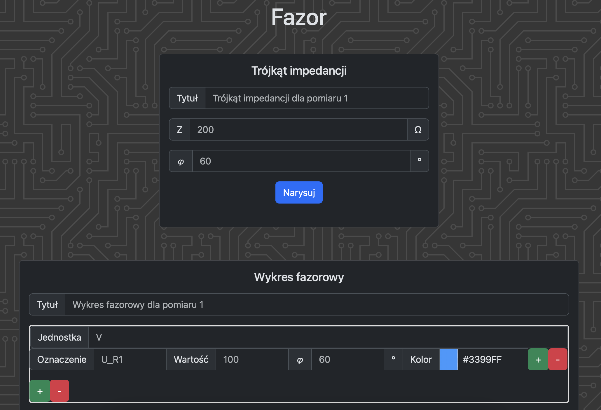

# Fazor
Same functionality as [phasors](https://github.com/k-wlosek/phasors), but as a static site.

## Usage
Go to [fazor.pages.dev](https://fazor.pages.dev).

## Development
Clone the repository and run it locally using basically any HTTP server.

It's a static site, so all Python code used to generate diagrams is run on clientside using [Pyodide](https://pyodide.org). Phasor diagrams are generated using `phasors` library, linked above, and is supplied as a wheel file in `static/python`. 
